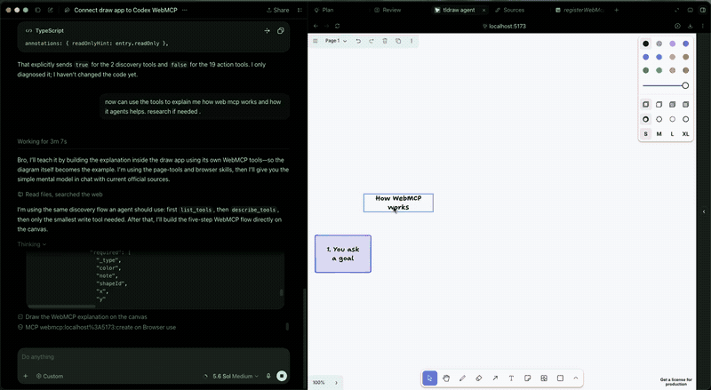
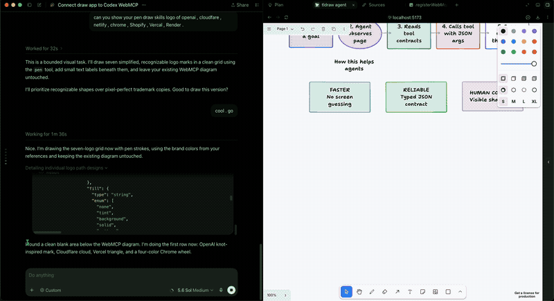

# tldraw agent

An AI drawing agent on a [tldraw](https://github.com/tldraw/tldraw) canvas. Chat on the right; the model creates shapes, HTML previews, and diagrams on the left.

This project uses the tldraw agent starter. It supports an AI chat agent, WebMCP canvas tools, and an optional local connection for Cursor, Codex, or Claude. An optional local MCP bridge on port 3001 lets Cursor / Codex / Claude control the same canvas over HTTP.

## WebMCP

[Open the WebMCP implementation on GitHub](https://github.com/mayank-devac/draw_generetoe/tree/main/client/webmcp) · [full tool catalog](tools.txt) · [agent guide](docs/webmcp-agent-guide.md)

WebMCP is the in-page tool API. The browser tab is the tool server. It is not the Node process in `server/index.ts`, and it does not use HTTP, SSE, or stdio.

When the tldraw agent mounts, `App.tsx` calls `registerWebMcpTools` in `client/webmcp/registerWebMcpTools.ts`. That registers canvas actions on `document.modelContext`. A WebMCP agent visits the live tab, calls a tool, and the shape change happens in that same page.





This is an early Chromium preview. You need Chromium `146.0.7672.0` or newer, plus the testing flag:

1. Open `chrome://flags/#enable-webmcp-testing` (or `edge://flags/#enable-webmcp-testing`).
2. Set it to Enabled and restart the browser.
3. Run `npm run dev` and open [http://127.0.0.1:5173/](http://127.0.0.1:5173/).
4. Point a WebMCP agent at that tab.

If the flag is off, `registerWebMcpTools` does nothing and the chat panel still works.

Action tools register with a stub schema. Call discovery first:

- `list_tools`. Every registered draw-app tool with a one-line purpose.
- `describe_tools`. Full argument schemas for 1 to 10 unique names, then call those tools.

Examples after that: `create`, `createHtmlPreview`, `update`, `delete`, `pen`. Layout helpers include `move`, `place`, `align`, and `stack`. Destructive WebMCP tools `delete` and `clear` require `confirm: true` after the user approves. Names and params for the full set live in `tools.txt`.

### What WebMCP can demonstrate

- **Drawing:** `pen` draws freehand or straight-point paths, with optional closing and fill styles.
- **Interactive concepts:** `createHtmlPreview` places a self-contained HTML, CSS, and JavaScript playground on the canvas.
- **Embedded references:** `inspect_embeds` returns the source URLs for tldraw embeds, including YouTube and Figma, so an agent can inspect what is already on the page.
- **Diagrams:** `create_mermaid_diagram` renders Mermaid source in a preview that the user can inspect or add to the canvas.
- **Open image sources:** `search_commons_images` finds verified CC0 or public-domain Wikimedia Commons images, and `add_commons_image` adds one with visible credit.
- **Canvas organization:** `inspect_pages`, `create_page`, `zoom_out`, and `arrange_grid` support page-aware workflows and readable layouts.

### What's new since August 25, 2026

The dates below are Git commit dates and provide a traceable record of the WebMCP work completed for this project:

- **August 31:** Added the in-page WebMCP foundation, tool registration, and the initial full catalog in [`6642c59`](https://github.com/mayank-devac/draw_generetoe/commit/6642c59).
- **August 31:** Added Wikimedia Commons search and insertion for non-copyright image sources, plus page-aware canvas tools in [`145f8fb`](https://github.com/mayank-devac/draw_generetoe/commit/145f8fb).
- **August 31:** Added Mermaid JS preview and canvas rendering in [`6b9b5cb`](https://github.com/mayank-devac/draw_generetoe/commit/6b9b5cb).
- **August 31:** Added embed inspection and zoom-out tools in [`e5a4738`](https://github.com/mayank-devac/draw_generetoe/commit/e5a4738), followed by grid arrangement in [`6cbea53`](https://github.com/mayank-devac/draw_generetoe/commit/6cbea53).
- **September 1:** Refactored WebMCP registration into a validated catalog with discovery tools, typed schemas, page/embed operations, and targeted tests in [`9d56d76`](https://github.com/mayank-devac/draw_generetoe/commit/9d56d76).
- **September 1:** Added fixture validation and WebMCP evaluation coverage in [`738802c`](https://github.com/mayank-devac/draw_generetoe/commit/738802c).
- **September 1:** Prepared a client-only judge build for Sites and hardened the judge presentation flow in [`1959d83`](https://github.com/mayank-devac/draw_generetoe/commit/1959d83), [`1798a24`](https://github.com/mayank-devac/draw_generetoe/commit/1798a24), and [`8a6e298`](https://github.com/mayank-devac/draw_generetoe/commit/8a6e298).

## Quick start

You need **Node 20+** and an API key for at least one model provider.

```bash
npm install
```

Create `.dev.vars` in the project root (this file is gitignored). Add only the keys for providers you will use:

```
GOOGLE_API_KEY=your_google_api_key
ANTHROPIC_API_KEY=your_anthropic_api_key
OPENAI_API_KEY=your_openai_api_key
OPEN_CODE=your_opencode_go_key
```

| Variable | Used for |
|----------|----------|
| `GOOGLE_API_KEY` | Gemini models |
| `ANTHROPIC_API_KEY` | Claude |
| `OPENAI_API_KEY` | OpenAI |
| `OPEN_CODE` | OpenCode Go models (Qwen, Grok, GPT-5.6 Luna, Kimi) |

Do **not** put keys in `.env`. This app is a Cloudflare Worker; Wrangler reads `.dev.vars` only. Never commit keys.

```bash
npm run dev
```

Open [http://127.0.0.1:5173/](http://127.0.0.1:5173/). That starts:

- the Vite app + worker on port **5173**
- the local MCP bridge on port **3001** (optional; the chat agent works without it)

If a model is missing its key, the chat will error with the variable name. Add that key to `.dev.vars` and restart `npm run dev`.

## Use the app

1. Pick a model in the chat input (only providers with keys appear as usable).
2. Type a prompt, for example: `Draw a login page` or `Make an interactive counter`.
3. Watch actions stream into the chat and onto the canvas.

Useful UI:

- **@ context** — attach the current selection, a point, or an area to the next prompt.
- **Pick shape / Pick area** — canvas tools (`s` / `c`) for the same context.
- **Todos** — the agent can keep a checklist for multi-step work.
- **HTML preview shapes** — for apps, simulations, or interactive UI the agent places a live HTML card on the canvas.
- **Cancel** — stop the current run.

You can also drive the agent from the browser console (the app exposes `window.agent` and `window.editor`):

```js
agent.prompt('Draw a cat')
agent.prompt({ message: 'Draw a cat here', bounds: { x: 0, y: 0, w: 300, h: 400 } })
agent.cancel()
agent.reset()
```

## MCP (optional)

`npm run dev` also runs `server/index.ts`. That process is **not** the LLM backend. It exposes the open canvas to an external assistant.

1. Keep the app open at `http://127.0.0.1:5173/`.
2. In the chat panel, open the MCP card and click **Connect canvas**.
3. Point your assistant at `http://127.0.0.1:3001/mcp`.

Codex example:

```bash
codex mcp add tldraw-canvas --url http://127.0.0.1:3001/mcp
```

Tools:

- `read_canvas` — shapes, selection, viewport, optional screenshot
- `apply_canvas_changes` — create / edit / layout / delete in one batch
- `undo_last_ai_change` — undo the last MCP batch if nothing else edited the canvas since

Only one MCP assistant can own the canvas at a time. The in-app chat agent and MCP can share the same board; connect the canvas only when you want an external tool to draw.

## Project layout

| Folder | Runs where | Role |
|--------|------------|------|
| `client/` | Browser | tldraw canvas, chat UI, applies actions |
| `worker/` | Cloudflare Worker | Holds API keys, calls the LLM, streams SSE |
| `shared/` | Both | Prompt parts, actions, models, MCP protocol |
| `server/` | Local Node | MCP WebSocket/HTTP bridge on port 3001 |

Request path for the in-app agent:

```
Chat panel → TldrawAgent → POST /stream → AgentDurableObject → AgentService → model
         ← streamed actions applied to the canvas
```

Key files:

| File | Change this when you want to… |
|------|-------------------------------|
| `shared/models.ts` | Add/remove models or change the default |
| `shared/AgentUtils.ts` | Change what the agent can see or do |
| `shared/parts/` | Change prompt context (screenshot, selection, history) |
| `shared/actions/` | Add or change canvas actions |
| `shared/parts/SystemPromptPartUtil.ts` | Edit the system prompt |
| `worker/do/AgentService.ts` | Change how providers are called |
| `client/agent/TldrawAgent.ts` | Change client prompt/stream/apply loop |
| `client/webmcp/registerWebMcpTools.ts` | Change which canvas tools a WebMCP agent can call |
| `tools.txt` | Full WebMCP tool names and argument schemas |
| `.dev.vars` | Local secrets (never commit) |

## Models

The chat model picker is generated from `AGENT_MODEL_DEFINITIONS` in `shared/models.ts`. Default model: `gpt-5.6-luna` (needs `OPEN_CODE`).

To add a model that already has a provider in this repo:

1. Add an entry to `AGENT_MODEL_DEFINITIONS`.
2. Put the matching key in `.dev.vars`.
3. Restart `npm run dev`.

To add a **new provider**:

1. Install its AI SDK package.
2. Register the provider name and env var in `shared/models.ts`.
3. Add the secret type in `worker/environment.ts`.
4. Create the client in `worker/do/AgentService.ts`.
5. Add models to `AGENT_MODEL_DEFINITIONS`.

Production secrets (not `.dev.vars`):

```bash
npx wrangler secret put GOOGLE_API_KEY
npx wrangler secret put OPEN_CODE
```

## Customize the agent

`shared/AgentUtils.ts` has two lists:

- `PROMPT_PART_UTILS` — what the model **sees** (screenshot, selected shapes, chat history, HTML on canvas, …)
- `AGENT_ACTION_UTILS` — what the model **does** (create/update/delete, HTML preview, think, message, …)

Remove an entry to disable it. Add a class and list it to enable a new capability.

Example demo actions (safe to remove from the list if you do not want them):

- `RandomWikipediaArticleActionUtil` — fetch a random Wikipedia summary, then continue drawing
- `CountryInfoActionUtil` — fetch REST Countries data by country code
- `CountShapesActionUtil` — count shapes on the page

Pattern for any external API: fetch inside `applyAction`, then `this.agent.schedule({ data: [result] })` so the next turn includes that data.

## Scripts

```bash
npm run dev          # app (5173) + MCP (3001)
npm run dev:app      # Vite / worker only
npm run dev:mcp      # MCP bridge only
npm run typecheck    # tsc --noEmit
npm run build        # typecheck + production Vite build
```

The canvas persists locally via tldraw’s `persistenceKey` (`tldraw-agent-demo`). Clearing site data resets the board.

## Deploy

This is a Cloudflare Workers + Vite app (`wrangler.toml`). Locally, the Cloudflare Vite plugin serves `/stream`. For production, set the same secrets with `wrangler secret put` and deploy with your usual Wrangler/Cloudflare flow. Do not use `npx wrangler deploy` as a substitute for local development.

The MCP server (`server/index.ts`) is **local-only**. It binds to `127.0.0.1:3001` and is not part of the Worker deploy.

## License

The original source code in this repository is provided under the [MIT License](LICENSE). The app includes the tldraw SDK as a dependency, which remains subject to tldraw's [SDK license](https://github.com/tldraw/tldraw/blob/main/LICENSE.md) and [trademark guidelines](https://github.com/tldraw/tldraw/blob/main/TRADEMARKS.md).

When using the tldraw SDK in this app, keep the "Made with tldraw" watermark; removing it requires a [business license](https://tldraw.dev#pricing).

## Trademarks

The tldraw name and logo are trademarks of tldraw Inc.; please follow the [trademark guidelines](https://github.com/tldraw/tldraw/blob/main/TRADEMARKS.md).
